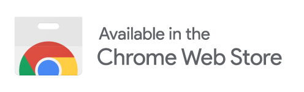

# Hacker News Sorted

[](https://chrome.google.com/webstore/detail/hacker-news-sorted/djkcnbncofmjekhlhemlkinfpkamlkaj)
[](https://chrome.google.com/webstore/detail/hacker-news-sorted/djkcnbncofmjekhlhemlkinfpkamlkaj)
[](https://chrome.google.com/webstore/detail/hacker-news-sorted/djkcnbncofmjekhlhemlkinfpkamlkaj)
[](https://github.com/svyatov/hacker_news_sorted/actions)
[](https://github.com/svyatov/hacker_news_sorted/blob/main/LICENSE)

Sort [Hacker News](https://news.ycombinator.com) your way — by points, time, or comments — instantly.

## Install

<a href="https://chrome.google.com/webstore/detail/hacker-news-sorted/djkcnbncofmjekhlhemlkinfpkamlkaj">
  
</a>

## Features

- **Sort by Points** — Find the most upvoted stories
- **Sort by Time** — See the newest posts first
- **Sort by Comments** — Discover the most discussed topics
- **Restore Default** — Return to HN's original ranking
- **New Post Indicators** — Orange dot marks posts that appeared since your last visit
- **Popup Settings** — Toggle new-post indicators from the extension icon
- **Keyboard Shortcuts** — Press `P`, `T`, `C`, or `D` to sort instantly
- **Persistent Preference** — Your last sort choice is remembered across sessions
- **Visual Highlighting** — Active sort column is highlighted for clarity
- **Vimium Compatible** — Shortcuts auto-disable if Vimium or similar extensions are detected

**Compatibility:** Works on any HN page with a post list (front page, Newest, Ask, Show, etc.)

## Privacy

No data collection, no external requests — works entirely in your browser.

## Tech Stack

Plasmo · React 19 · TypeScript · Vitest · Bun

## Development

```bash
git clone git://github.com/svyatov/hacker_news_sorted.git
cd hacker_news_sorted
bun install
bun dev
```

Then load the extension in Chrome: go to `chrome://extensions`, enable "Developer mode", click "Load unpacked", and select the `build/chrome-mv3-dev` folder.

```bash
bun run test           # Run tests
bun run test:watch     # Run tests in watch mode
bun run test:coverage  # Run tests with coverage report
bun run lint           # Run ESLint and Prettier checks
bun run fixture:update # Fetch fresh HN HTML for test fixtures
bun run screenshots    # Generate Chrome Web Store screenshots (requires build first)
```

## Issues

Found a bug or have a suggestion? [Open an issue](https://github.com/svyatov/hacker_news_sorted/issues).

## Contributing

1. Fork it
2. Create your feature branch (`git checkout -b my-new-feature`)
3. Make your changes and run tests (`bun run test`)
4. Commit using [Conventional Commits](https://www.conventionalcommits.org/en/v1.0.0/) format (`git commit -m 'feat: add some feature'`)
5. Push to the branch (`git push origin my-new-feature`)
6. Create new Pull Request

## Changelog

See [CHANGELOG.md](CHANGELOG.md) for a detailed history of changes, following [Keep a Changelog](https://keepachangelog.com/en/1.1.0/) format.

## License

[MIT](LICENSE)
