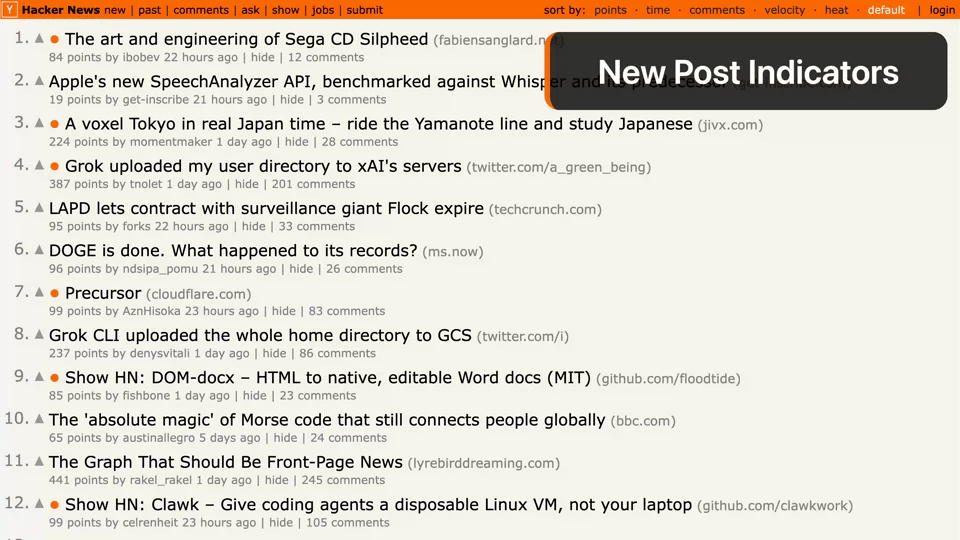

# Hacker News Sorted

[](https://chrome.google.com/webstore/detail/hacker-news-sorted/djkcnbncofmjekhlhemlkinfpkamlkaj)
[](https://chrome.google.com/webstore/detail/hacker-news-sorted/djkcnbncofmjekhlhemlkinfpkamlkaj)
[](https://chrome.google.com/webstore/detail/hacker-news-sorted/djkcnbncofmjekhlhemlkinfpkamlkaj)
[](https://github.com/svyatov/hacker_news_sorted/actions)
[](https://codecov.io/gh/svyatov/hacker_news_sorted)
[](https://github.com/svyatov/hacker_news_sorted/blob/main/LICENSE)

Instantly sort [Hacker News](https://news.ycombinator.com) by points, time, comments, velocity, or heat, mark new posts, and highlight comment authors.



## Install

<a href="https://chrome.google.com/webstore/detail/hacker-news-sorted/djkcnbncofmjekhlhemlkinfpkamlkaj">
  
</a>

## Features

- **Sort by Points**: Find the most upvoted stories
- **Sort by Time**: See the newest posts first
- **Sort by Comments**: Discover the most discussed topics
- **Sort by Velocity**: Surface the fastest-rising posts (points per hour, damped so brand-new posts don't dominate), with an on/off toggle in the popup
- **Sort by Heat**: Find where the debate is (comments per point), with an on/off toggle in the popup
- **Restore Default**: Return to HN's original ranking
- **New Post Indicators**: Orange dot marks posts that appeared since your last visit, fading out over a configurable period
- **True Time Ago**: Corrects misleading ages on resurfaced "second chance" posts
- **Comment Author Highlighting**: On thread pages, the story author's comments get a subtle tint and an "OP" badge. Click another commenter's diamond to highlight their comments, click it again to clear the mark, or choose someone else. The mark survives reloads within the tab's session. OP and marked-user highlights have independent popup toggles. When signed in, your loaded replies automatically get a lighter tint and a "You" badge; enabled OP highlighting takes priority if you are the author. Your account is identified from the current page
- **Keyboard Shortcuts**: Press `P`, `T`, `C`, `V`, `H`, or `D` to sort instantly. Shortcuts stay inactive while you type
- **Comment Navigation**: Choose OP, Marked user, or You in the compact sticky toolbar, then use Previous/Next or `[` / `]` to follow visible, loaded comments. **Oldest first** is the default; select **Thread order** in the popup to follow HN's page order without rearranging the discussion. Collapsed branches are skipped, and navigation stops at both ends. Jumps scroll smoothly, or instantly with reduced motion. Repeated presses advance from the intended target; manual scrolling establishes a new reading position. Highlight switches control OP and Marked user availability; You requires a signed-in account. Turn off **Comment navigation** to hide the bar and disable its shortcuts while keeping highlights and your order preference. Bracket shortcuts ignore native controls, composition, and modified presses; toolbar controls also support Tab and Enter/Space
- **Responsive Menu**: Full sort names on wide screens, single-letter labels on medium screens, and a compact dropdown on narrow screens, always collapsing before it would crowd Hacker News's own header links
- **Synced Preferences**: Your sort choice, settings, and new-post history can follow you across devices when Chrome sync is enabled
- **Visual Highlighting**: Active sort column is highlighted for clarity
- **Layout Change Detection**: Warning badge and popup banner if HN changes break sorting
- **Shortcut Conflict Detection**: If another handler intercepts a sort or navigation key, the affected set of shortcuts is disabled with an explanation; clickable controls remain available. Detection is best-effort and cannot catch every competing handler
- **Dark Mode**: Settings popup follows your system light/dark color scheme

**Compatibility:** Sorting works on HN story lists (front page, Newest, Ask, Show, etc.); comment highlighting and navigation work on thread (`item?id=`) pages. OP highlighting is available only when the top item is a story.

## Privacy

No analytics, tracking, or external API calls. The extension reads the HN page you are viewing and processes its data in your browser.

## Tech Stack

WXT · React 19 · TypeScript · Vitest · Bun

## Development

```bash
git clone https://github.com/svyatov/hacker_news_sorted.git
cd hacker_news_sorted
bun install
bun dev
```

Then load the extension in Chrome: go to `chrome://extensions`, enable "Developer mode", click "Load unpacked", and select the `build/chrome-mv3-dev` folder.

```bash
bun run test           # Run tests
bun run test:watch     # Run tests in watch mode
bun run test:coverage  # Run tests with coverage report
bun run lint           # Run Biome, Prettier, and TypeScript checks
bun run build          # Build production extension in build/chrome-mv3
bun run fixture:update # Fetch fresh HN HTML for test fixtures
bun run screenshots    # Generate Chrome Web Store screenshots (requires build first)
```

## Issues

Found a bug or have a suggestion? [Open an issue](https://github.com/svyatov/hacker_news_sorted/issues).

## Contributing

1. Fork it
2. Create your feature branch (`git switch -c feat/my-new-feature`)
3. Make your changes and run the required checks (`bun run lint`, `bun run test:coverage`, and `bun run build`). Keep test coverage at 100% and update affected documentation and the Unreleased changelog
4. Commit using [Conventional Commits](https://www.conventionalcommits.org/en/v1.0.0/) format (`git commit -m 'feat: add some feature'`)
5. Push to the branch (`git push -u origin feat/my-new-feature`)
6. Create new Pull Request

## Changelog

See [CHANGELOG.md](CHANGELOG.md) for a detailed history of changes, following [Keep a Changelog](https://keepachangelog.com/en/1.1.0/) format.

## License

[MIT](LICENSE)
